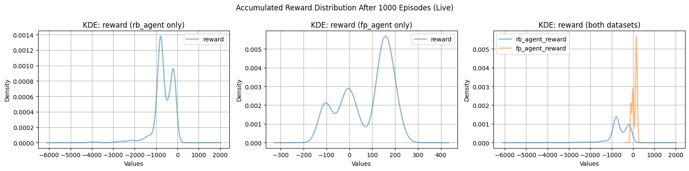

# Offline Reinforcement Learning 
## Practical work in AI, WS2024/25, JKU
# Introduction

This project explores the performance of two Behavior Cloning (BC) agents trained in an offline setting in the Lunar Lander environment. The BC models are built using a Feedforward Neural Network (FNN) architecture and trained on two distinct datasets generated by a Deep Q-Network (DQN) agent.

* __Replay Buffer Dataset__ – Captures the agent’s learning experience throughout training in a typical online setting.

* __Final Policy Dataset__ – Generated using the fully trained DQN agent’s final policy.

> [!NOTE]
> The datasets used in this experiment were provided by my supervisor as part of the task description.


Both BC agents are then evaluated in a live environment for 1,000 episodes each, using fixed random seed to ensure reproducibility.

The performance of the models is as follows:
| Model Type  | Test Accuracy | Reward (SD) | Reward (Mean) |
|------------|--------------|-------------|---------------|
| Replay Buffer BC    | 66.35%          |     478.4     |       -644.4      |
| Final Policy BC    | 96.83%          | 107.7          | 75.49            |



## How to Run Locally

### Dependencies and Prerequirements
Ensure you have Python 3.10 installed. This project also requires the following dependencies:

```pip-requirements
gymnasium==1.0.0
matplotlib==3.6.1
numpy==1.25.2
pandas==1.5.0
scikit_learn==1.2.2
torch==1.13.0
tqdm==4.64.1
tensorboard
```

### Installation Guide
#### 1. Clone the Repository
Run the following command to clone the repository:

```git-clone
git clone https://github.com/andonov16/Offline_RL_PW.git
```

#### 2. Install the dependencies
Run the following command to install the required dependencies:

```install-requirements
cd /path-to-project-main-folder
pip install -r requirements.txt
```

For statistical metrics and visualizations of the two datasets, open the Jupyter notebook located at:
```install-requirements
/notebooks/data_exploration.ipynb
```

This notebook provides insights into the environment, statistical properties of the datasets, KDE plots, box plots, histograms, and more.

### Evaluating the BC Agents


To visually assess the performance of the two trained BC agents in a live environment, run the corresponding test scripts:

* Replay Buffer BC model:
```run-rb-bc-live-env
cd /path-to-project-main-folder
py ./tests/test_rb_bc.py
```

* Final Policy BC model:
```run-rb-bc-live-env
cd /path-to-project-main-folder
py ./tests/test_fp_bc.py
```

### Modifying Environment Settings
To customize the environment seed and the number of episodes, modify the configuration file:

```env-config
config/env_test_config.json
```

### Model Training

If you want to train the models from scratch, including hyperparameter tuning, execute the corresponding experiment scripts:

* Replay Buffer BC model:
```run-rb-bc-live-experiment
cd /path-to-project-main-folder
py ./experiments/experiment_rb_bc.py
```

* Final Policy BC model:
```run-rb-fp-experiment
cd /path-to-project-main-folder
py ./experiments/experiment_fp_bc.py
```

### Hyperparameter Tuning Customization
To adjust the hyperparameter ranges for Grid Search tuning, update the corresponding config files:

* Replay Buffer BC model:
```rb-experiment-config
/config/rb_bc_config.json
```

* Final Policy BC model:
```fp-experiment-config
/config/fp_bc_config.json
```
## Author

- [Miroslav Andonov](https://github.com/andonov16)